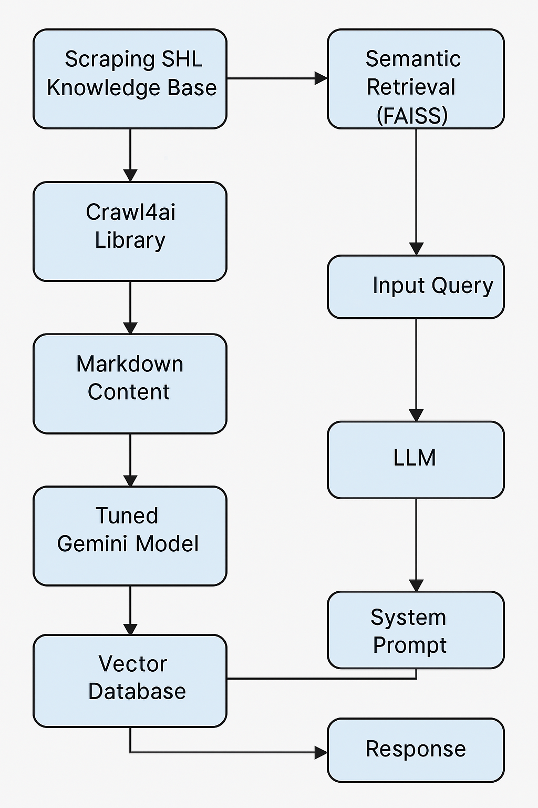
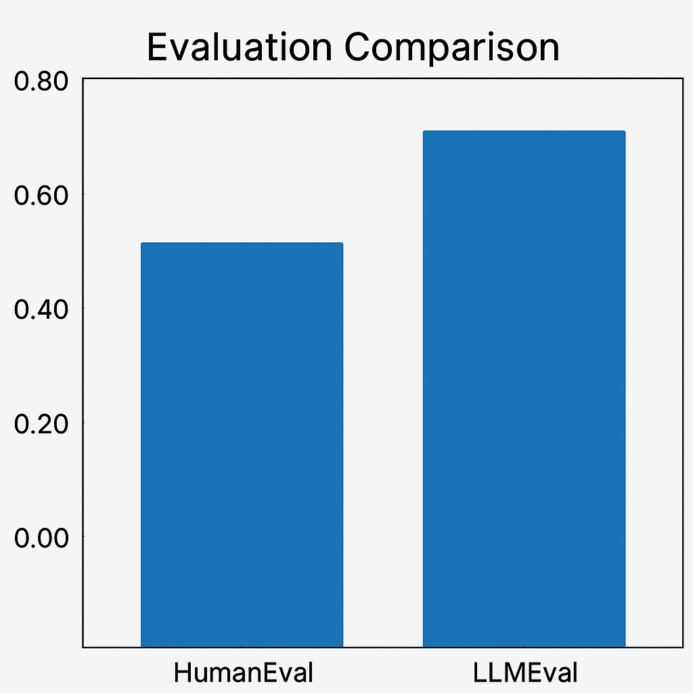

# 🔍 SHL Semantic Reasoning Assistant

> A next-gen AI-powered assistant that thinks before it speaks — designed to *reason*, *retrieve*, and *respond* with unmatched accuracy.

---

## 🚀 Demo

🔗 **Live Demo**: [Click here to experience it!](https://shl-assignment-lpldk2fapbnxatgxtnmhyr.streamlit.app/)  
> ⚠️ *Note*: The app is hosted on a serverless instance. It may take **up to 50 seconds** to load on a cold start.
---

## 🧠 

This project is a fusion of cutting-edge technologies to build a **logic-first, hallucination-free** AI assistant capable of intelligent Q&A over SHL knowledge base articles. It scrapes, understands, and reflects — before responding.

---

## 🗂️ Key Features

- ✅ **SHL Knowledge Base Integration**  
  Scrapes and structures SHL documentation into markdown using `crawl4ai` for optimal LLM parsing.

- 🔍 **Semantic Search with FAISS + HuggingFace**  
  Uses high-quality embeddings for lightning-fast and meaningful document retrieval.

- 🧩 **Tuned Gemini LLM**  
  Finely-tuned with handcrafted reasoning samples and backed by a markdown-powered system prompt to ensure accuracy and reflection.

- 🌐 **Live Link Attestation**  
  Query inputs are scanned for links, which are scraped and processed on-the-fly to support answers with real data.

- 🔁 **Chained Query Architecture**  
  Input → Vector Retrieval → Prompt Logic → Answer Generation — all handled seamlessly using LangChain.

- 💻 **Interactive UI**  
  Deployed with Streamlit for a sleek, no-friction user experience. Cold starts may take up to 50 seconds (free Render tier).

---

## 📊 Performance

| Metric         | Score |
|----------------|-------|
| HumanEval      | 0.60  |
| LLMEval        | 0.73  |

⚙️ **Optimized for**: Clarity, reflection, and precision in response generation.

---

## 🧰 Tech Stack

- 🧠 LLM: **Gemini** (tuned with handcrafted samples)
- 🔎 Retrieval: **FAISS** + **Hugging Face Transformers**
- 🕸️ Scraping: `crawl4ai` (HTML → Markdown)
- 🧠 Prompting: Markdown system prompt w/ reasoning logic
- 🧱 Framework: **LangChain**
- 🌐 Deployment: **Streamlit** + **Render**

---

## 🧠 Architecture Overview

---

## 📈 Evaluation Visualization

---

## 📬 Feedback & Contributions

Ideas? Suggestions? Feel free to open an issue or drop a star ⭐ if you find this useful or inspiring!

---

## 📄 License

This project is open-sourced under the MIT License.

---

> Created with 💡, logic, and a sprinkle of LLM magic.
